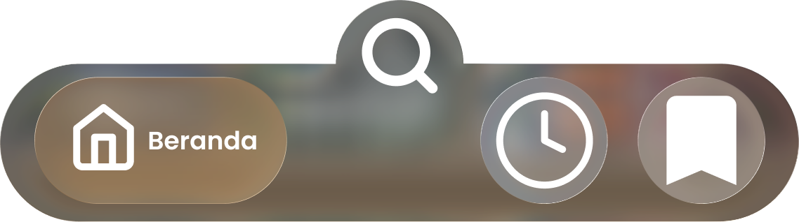

<div align="center">


# 🎬 FlixyGo

<h3>🌟 Your Ultimate Streaming Platform for Movies, K-Dramas & Anime 🌟</h3>

<p>
  
  
  
</p>

### 🚀 Built With

[](https://flutter.dev/)
[](https://dart.dev/)
[](https://supabase.com/)
[](https://www.microsoft.com/windows)
[](https://www.android.com/)

---

### 📖 Quick Navigation

<p>
  <a href="#-features"><b>✨ Features</b></a> •
  <a href="#-screenshots"><b>📸 Screenshots</b></a> •
  <a href="#-installation"><b>🚀 Installation</b></a> •
  <a href="#-tech-stack"><b>🛠️ Tech Stack</b></a> •
  <a href="#-team"><b>👥 Team</b></a> •
  <a href="#-contributing"><b>🤝 Contributing</b></a>
</p>

---

<p align="center">
  <b>Experience seamless streaming with an elegant interface designed for<br/>
  movie lovers, K-Drama enthusiasts, and anime fans.</b>
</p>

<p>
  <a href="https://github.com/yourusername/flixygo/releases">
    
  </a>
  <a href="https://github.com/yourusername/flixygo/issues">
    
  </a>
  <a href="https://github.com/yourusername/flixygo/issues">
    
  </a>
</p>

</div>

---

## ✨ Features

<div align="center">

### 🎯 **What Makes FlixyGo Special?**

</div>

<table>
<tr>
<td width="50%">

### 🎥 **Rich Content Library**
- 🎬 **Movies** - Extensive collection of latest and classic films
- 🇰🇷 **K-Dramas** - Popular Korean dramas with episode tracking
- 🎌 **Anime** - Wide selection of anime series and movies
- 📺 **Multi-Episode Support** - Seamlessly track and watch episodes

</td>
<td width="50%">

### 📱 **Exceptional User Experience**
- 🎨 **Beautiful UI** - Modern interface with smooth animations
- 🌙 **Dark Theme** - Eye-friendly design for binge-watching
- 🔍 **Smart Search** - Find content quickly with filters
- ⭐ **Favorites** - Save and organize your favorite shows

</td>
</tr>
<tr>
<td width="50%">

### 🎬 **Advanced Video Player**
- 📺 **Full HD Playback** - High-quality video streaming
- 🔄 **Landscape Mode** - Auto-rotation for fullscreen
- 🔒 **Screen Lock** - Prevent accidental touches
- ⏯️ **Full Controls** - Play, pause, seek, rewind, fast-forward
- ⏭️ **Auto Next Episode** - Seamless episode transitions

</td>
<td width="50%">

### 🔐 **Secure Authentication**
- 📧 **Email Login** - Secure authentication system
- 🆕 **Easy Sign Up** - Quick registration process
- 🔄 **Password Recovery** - Reset forgotten passwords
- 👁️ **Biometric Login** - Fingerprint authentication
- 💾 **Cloud Sync** - Powered by Supabase

</td>
</tr>
</table>

<div align="center">

### 🌟 **Additional Features**


</div>

---

## 📸 Screenshots

<div align="center">

### 🏠 Home & Navigation




### 🎬 Content & Video Player


### 👤 User Interface


</div>

---

## 🚀 Installation

### Prerequisites

- **Flutter SDK** >= 3.12.2
- **Dart SDK** >= 3.0.0
- **Android Studio** or **VS Code** with Flutter extensions
- **Android SDK** (for Android builds)
- **Git**

### 📦 Clone the Repository

```bash
git clone https://github.com/yourusername/flixygo.git
cd flixygo
```

### 🔧 Install Dependencies

```bash
flutter pub get
```

### 🔑 Configure Supabase

1. Create a `supabase-keys.json` file in the root directory:

```json
{
  "supabaseUrl": "your-supabase-url",
  "supabaseAnonKey": "your-supabase-anon-key"
}
```

2. Get your keys from [Supabase Dashboard](https://app.supabase.com/)

### 🎯 Run the App

#### For Android:
```bash
flutter run --dart-define-from-file=supabase-keys.json
```

#### For Windows:
```bash
flutter run -d windows --dart-define-from-file=supabase-keys.json
```

### 📱 Build APK (Android)

```bash
# Debug APK
flutter build apk --debug --dart-define-from-file=supabase-keys.json

# Release APK
flutter build apk --release --dart-define-from-file=supabase-keys.json
```

Output: `build/app/outputs/flutter-apk/app-release.apk`

### 🪟 Build Windows

```bash
flutter build windows --dart-define-from-file=supabase-keys.json
```

---

## 🛠️ Tech Stack

### **Frontend Framework**
- **Flutter** - Cross-platform UI framework
- **Dart** - Programming language

### **UI/UX**
- **Google Fonts** - Typography (Poppins)
- **Custom Animations** - Smooth transitions and effects
- **Material Design** - Modern design principles

### **Backend & Database**
- **Supabase** - Backend-as-a-Service
  - Authentication
  - PostgreSQL Database
  - Real-time subscriptions
  - Cloud Storage

### **Video Playback**
- **media_kit** - Cross-platform video player
- **media_kit_video** - Video rendering
- **media_kit_libs_windows_video** - Windows codec support
- **media_kit_libs_android_video** - Android codec support

### **Additional Libraries**
- **shared_preferences** - Local data persistence
- **path_provider** - File system access
- **url_launcher** - External link handling
- **webview_flutter** - In-app web views (Android)
- **webview_windows** - In-app web views (Windows)
- **file_picker** - File selection dialogs

---

## 🏗️ Project Structure

```
flixygo/
├── android/                    # Android-specific files
├── windows/                    # Windows-specific files
├── assets/
│   ├── images/                # App images and icons
│   └── design/                # Design mockups and screenshots
├── lib/
│   ├── models/                # Data models
│   ├── pages/                 # UI screens
│   │   ├── home_page.dart
│   │   ├── login_page.dart
│   │   ├── video_player_page.dart
│   │   ├── profile_page.dart
│   │   └── ...
│   ├── services/              # Business logic and API services
│   │   ├── auth_service.dart
│   │   ├── stream_service.dart
│   │   ├── comment_service.dart
│   │   └── ...
│   ├── theme/                 # App theming
│   │   └── app_theme.dart
│   ├── env.dart               # Environment configuration
│   └── main.dart              # App entry point
├── pubspec.yaml               # Dependencies
└── README.md                  # This file
```

---

## 🎨 Features in Detail

### 🔐 Authentication System
- Username/Password authentication
- Biometric login support
- Session management
- Secure password storage

### 📺 Video Streaming
- **Adaptive Streaming** - Adjusts quality based on connection
- **Multiple Sources** - Support for various streaming providers
- **Episode Management** - Track watched episodes
- **Auto-play Next** - Seamless episode transitions

### 💬 Community Features
- **Comment System** - Share thoughts on content
- **User Profiles** - Customizable profiles with avatars
- **Favorites** - Bookmark your favorite shows
- **Watch History** - Track viewing progress

### 🌐 Multi-Platform Support
- **Android** - Optimized for mobile devices (Android 14+)
- **Windows** - Full desktop experience (Windows 10/11)
- Responsive UI adapts to different screen sizes

---

## 🐛 Known Issues & Fixes

### Memory Issues (Low RAM Devices)
If you experience crashes on devices with 4GB RAM or less, the Gradle memory settings have been optimized:
- Max heap: 2GB (down from 8GB)
- Suitable for budget devices

### Icon Configuration
The app uses standard launcher icons for better compatibility across Android versions.

### Video Player
- Some streaming sources may require specific headers
- Embedded videos work with proper CORS configuration

For detailed troubleshooting, see our [docs](docs/) folder.

---

## 📝 License

This project is licensed under the **MIT License** - see the [LICENSE](LICENSE) file for details.

---

## 👥 Team

### **Digital Aegis Team**

<div align="center">

<table>
  <tr>
    <td align="center" width="50%">
      <a href="https://instagram.com/lxthfyy_">
        
      </a>
      <br /><br />
      <h3>Luthfi Nur Zaidan</h3>
      <p><b>🚀 Lead Developer & Founder</b></p>
      <p><i>Full-stack developer specializing in Flutter & backend architecture</i></p>
      <br />
      <a href="https://instagram.com/lxthfyy_">
        
      </a>
      <br />
      <sub>@lxthfyy_</sub>
    </td>
    <td align="center" width="50%">
      <a href="https://instagram.com/_noctyr">
        
      </a>
      <br /><br />
      <h3>Abhipraya Samboga</h3>
      <p><b>🎨 UI/UX Designer</b></p>
      <p><i>Creating beautiful and intuitive user experiences</i></p>
      <br />
      <a href="https://instagram.com/_noctyr">
        
      </a>
      <br />
      <sub>@_noctyr</sub>
    </td>
  </tr>
</table>

</div>

### 📧 Contact Us

<div align="center">

**Have questions or feedback? We'd love to hear from you!**

[](mailto:Digitalaegis12@gmail.com)
[](https://instagram.com/lxthfyy_)
[](https://instagram.com/_noctyr)

**📬 Email:** [Digitalaegis12@gmail.com](mailto:Digitalaegis12@gmail.com)

</div>

---

<div align="center">

## 📊 Project Stats

<p>
  
  
  
  
</p>

<p>
  
  
  
</p>

</div>

---

## 🤝 Contributing

<div align="center">

**We welcome contributions from the community!** 🎉

</div>

Contributions are what make the open-source community an amazing place to learn, inspire, and create. Any contributions you make are **greatly appreciated**!

### How to Contribute:

1. 🍴 **Fork the Project**
2. 🌿 **Create your Feature Branch**
   ```bash
   git checkout -b feature/AmazingFeature
   ```
3. 💾 **Commit your Changes**
   ```bash
   git commit -m 'Add some AmazingFeature'
   ```
4. 📤 **Push to the Branch**
   ```bash
   git push origin feature/AmazingFeature
   ```
5. 🎯 **Open a Pull Request**

### Contribution Guidelines:

- 📝 Write clear and descriptive commit messages
- 🧪 Test your changes thoroughly
- 📚 Update documentation as needed
- 🎨 Follow the existing code style
- 🐛 Report bugs using GitHub Issues
- 💡 Suggest new features via Issues

See [CONTRIBUTING.md](CONTRIBUTING.md) for detailed guidelines.

---

## ⭐ Star History

<div align="center">

**If you like this project, please give it a ⭐ on GitHub!**

[](https://star-history.com/#yourusername/flixygo&Date)

</div>

---

## 🙏 Acknowledgments

<div align="center">

We're grateful to these amazing projects and communities:

</div>

- 🦋 **[Flutter Team](https://flutter.dev/)** - Amazing cross-platform framework
- 🗄️ **[Supabase](https://supabase.com/)** - Powerful backend infrastructure
- 🎬 **[Media Kit](https://github.com/alexmercerind/media_kit)** - Excellent video playback library
- 🔤 **[Google Fonts](https://fonts.google.com/)** - Beautiful typography (Poppins)
- 🎨 **Open Source Community** - For inspiration and support
- 💝 **All Contributors** - Thank you for your valuable contributions!

---

<div align="center">

## 💖 Support the Project

<p><b>If you find FlixyGo useful, consider giving it a star! ⭐</b></p>

<p>
  <a href="https://github.com/yourusername/flixygo">
    
  </a>
  <a href="https://github.com/yourusername/flixygo/fork">
    
  </a>
  <a href="https://github.com/yourusername/flixygo/watchers">
    
  </a>
</p>

</div>

---

<div align="center">


### 🎬 Made with ❤️ and ☕ by **Digital Aegis Team**

<p>
  <b>© 2024 FlixyGo. All Rights Reserved.</b><br/>
  <sub>Crafted with passion for movie lovers worldwide</sub>
</p>

<p>
  <a href="https://flutter.dev">
    
  </a>
  <a href="https://dart.dev">
    
  </a>
  <a href="https://supabase.com">
    
  </a>
</p>

---

<p>
  <a href="#-flixygo">⬆ Back to Top</a>
</p>

<p>
  <sub>🌟 Star us on GitHub — it motivates us a lot! 🌟</sub>
</p>

</div>
