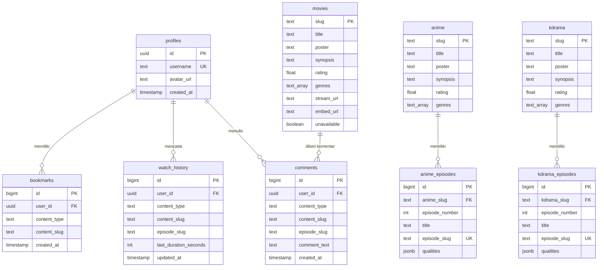

# LAPORAN PROYEK PENGEMBANGAN APLIKASI FLIXYGO
**Aplikasi Streaming Multi-Platform Film, Anime, dan Drama Korea Berbasis Flutter & Supabase**

---

## RINGKASAN EKSEKUTIF

FlixyGo adalah aplikasi layanan pengaliran media (streaming platform) modern berkinerja tinggi yang dirancang untuk platform lintas penyedia (cross-platform: Android, iOS, Windows, macOS, dan Linux). Aplikasi ini memadukan kemudahan antarmuka pengguna (UI) modern berbasis kerangka kerja **Flutter** dengan keandalan infrastruktur backend berbasis **Supabase** (PostgreSQL, Supabase Auth, dan Supabase Storage).

Laporan ini menyajikan secara menyeluruh latar belakang pengembangan, arsitektur perangkat lunak, perancangan basis data, mekanisme keamanan *Row Level Security* (RLS), implementasi fitur-fitur utama (streaming video multi-kualitas, riwayat tontonan, favorit/bookmark, komentar interaktif, dan manajemen profil), pengujian lintas platform, serta evaluasi sistem.

---

## BAB I: PENDAHULUAN

### 1.1 Latar Belakang
Perkembangan teknologi hiburan digital saat ini mendorong peningkatan konsumsi konten video seperti film layar lebar, anime, dan drama Korea (*K-Drama*). Pengguna membutuhkan platform pengaliran media yang responsif, terintegrasi, hemat sumber daya, serta dapat diakses baik dari perangkat seluler (Android/iOS) maupun komputer meja (Desktop Windows/macOS/Linux).

Namun, banyak aplikasi streaming yang menemui kendala seperti tingginya kerumitan instalasi backend, kurangnya dukungan multi-platform yang mulus (terutama pada lingkungan Desktop), serta isu performa pada pemutar video. FlixyGo dibangun untuk menjawab tantangan tersebut dengan memanfaatkan arsitektur hybrid *Flutter + Supabase + MediaKit Engine*, menghadirkan pengalaman menonton yang cepat, aman, dan konsisten.

### 1.2 Perumusan Masalah
1. Bagaimana membangun aplikasi streaming film, anime, dan K-Drama yang berkinerja tinggi serta dapat berjalan mulus secara *cross-platform* (Mobile & Desktop)?
2. Bagaimana merancang skema basis data relasional yang efisien di Supabase untuk mengelola katalog multi-kategori, episode bertingkat, riwayat tontonan, bookmark, dan komentar pengguna?
3. Bagaimana mengatasi keterbatasan komponen pemutar video WebView pada OS Windows tanpa menyebabkan kegagalan aplikasi (*crash*)?
4. Bagaimana menerapkan sistem keamanan data pengguna berbasis *Row Level Security* (RLS) pada Supabase?

### 1.3 Tujuan Pengembangan
- Menghasilkan aplikasi streaming film, anime, dan K-Drama yang responsif dan fleksibel.
- Mengimplementasikan backend serverless berbasis **Supabase** dengan autentikasi aman, basis data PostgreSQL, dan media storage.
- Menyediakan fitur lengkap seperti: pencarian real-time, filter genre, pemutar video multi-server/kualitas, riwayat tontonan (*watch history*), favorit (*bookmarks*), foto profil kustom, dan komentar pengguna.
- Menghadirkan antarmuka bertema gelap (*Dark Mode Theme*) yang elegan dan konsisten di seluruh layar.

### 1.4 Batasan Sistem
- Sumber streaming menggunakan URL stream/embed yang disinkronisasikan melalui basis data Supabase.
- Pengunggahan foto profil disimpan pada bucket `avatars` di Supabase Storage.
- Autentikasi pengguna memanfaatkan Supabase Auth dengan skema identifikasi unik username.

---

## BAB II: ARSITEKTUR SISTEM DAN TEKNOLOGI

### 2.1 Stack Teknologi
Aplikasi FlixyGo dibangun menggunakan komponen teknologi berikut:

| Komponen | Teknologi | Deskripsi |
| :--- | :--- | :--- |
| **Frontend Framework** | Flutter (Dart SDK 3.12+) | Framework UI lintas platform untuk Mobile & Desktop. |
| **Backend & Database** | Supabase (PostgreSQL 15+) | Backend-as-a-Service untuk Auth, Database, RLS, & Storage. |
| **Video Engine (Desktop/Native)** | `media_kit` ^1.1.10 | Engine pemutar video native berbasis LibMPV untuk Windows & Mobile. |
| **Web Engine (Embed)** | `webview_flutter` & `url_launcher` | Penanganan web-embed video player pada mobile & eksternal browser launcher pada desktop. |
| **State & Asset Management** | Shared Preferences & File Picker | Manajemen cache lokal, setelan aplikasi, serta pemilihan file media. |

### 2.2 Arsitektur Direktori Proyek
Struktur kode FlixyGo dirancang modular mengikut skema pemisahan logika (Service-Model-UI):

```
lib/
├── env.dart                        # Konfigurasi Environment & Key Supabase
├── main.dart                       # Inisialisasi Aplikasi & MediaKit
├── models/
│   ├── api_models.dart             # Model data (ContentDetail, StreamData, Comment, History, Bookmark)
│   └── movie_item.dart             # Model item katalog UI & ContentType enum
├── services/
│   ├── api_client.dart             # Exception Handler & Helper Supabase
│   ├── auth_service.dart           # Layanan Log in, Sign up, & Logout Supabase Auth
│   ├── bookmark_service.dart       # Layanan CRUD Favorit / Bookmark
│   ├── comment_service.dart        # Layanan Komentar Konten & Episode
│   ├── content_service.dart        # Layanan Fetch Katalog, Banner, Terpopuler, & Filter Genre
│   ├── profile_photo_service.dart  # Layanan Upload/Clear Foto Profil ke Supabase Storage
│   ├── stream_service.dart         # Layanan Resolusi Stream URL & Qualities Multi-Server
│   └── watch_history_service.dart  # Layanan Riwayat Tontonan & Progres Durasi
├── theme/
│   └── app_theme.dart              # Desain Sistem (Warna AppColors, Tipografi, Theme Data)
└── pages/
    ├── login_page.dart             # Layar Autentikasi & Masuk Akun
    ├── home_page.dart              # Layar Beranda, Navigasi Utama, Filter, & Search
    ├── movie_detail_page.dart      # Detail Film & Pemutar Langsung
    ├── anime_kdrama_detail_page.dart # Detail Anime/K-Drama & Daftar Episode
    ├── video_player_page.dart      # Pemutar Video Kustom, Server Selector, & Komentar
    ├── favorite_page.dart          # Layar Koleksi Favorit Pengguna
    ├── history_page.dart           # Layar Riwayat Tontonan Lengkap
    ├── collection_page.dart        # Layar Kelola Koleksi
    ├── profile_page.dart          # Layar Profil Pengguna & Edit Foto
    ├── settings_page.dart         # Layar Pengaturan Aplikasi
    └── about_app_page.dart        # Layar Informasi Aplikasi & Versi
```

---

## BAB III: PERANCANGAN BASIS DATA & KEAMANAN

### 3.1 Skema Tabel Supabase (PostgreSQL)
Sistem menggunakan 9 tabel relasional utama pada PostgreSQL Supabase:



### 3.2 Keamanan Row Level Security (RLS) & Policies
Untuk menjamin keamanan data antar pengguna, setiap tabel dilindungi oleh kebijakan RLS di Supabase:

1. **Profiles Table**:
   - `SELECT`: Bebas diakses publik (`true`).
   - `UPDATE`: Hanya pemilik akun (`auth.uid() = id`).
2. **Bookmarks & Watch History**:
   - `SELECT / INSERT / UPDATE / DELETE`: Terisolasi ketat untuk pemilik data (`auth.uid() = user_id`).
3. **Comments Table**:
   - `SELECT`: Publik dapat membaca semua komentar.
   - `INSERT`: Hanya pengguna terautentikasi (`auth.uid() = user_id`).
4. **Storage Bucket `avatars`**:
   - Policy membaca foto profil dibuka untuk umum (*public bucket*).
   - Upload/Update/Delete hanya diizinkan dalam folder milik pengguna (`(storage.foldername(name))[1] = auth.uid()::text`).

---

## BAB IV: IMPLEMENTASI FITUR UTAMA

### 4.1 Autentikasi Pengguna (`AuthService`)
Sistem autentikasi memanfaatkan Supabase Auth yang dipadukan dengan relasi tabel `profiles`. Saat pendaftaran akun baru:
- Username pengguna diubah secara otomatis menjadi format email internal `username@flixygo.local`.
- Database Trigger Postgres (`handle_new_user()`) secara otomatis membuatkan entri baru di tabel `profiles`.

### 4.2 Pemutar Video Multi-Stream & Multi-Server (`StreamService` & `VideoPlayerPage`)
Mekanisme streaming FlixyGo mampu memproses berbagai sumber media:
- **Direct Stream (MP4/HLS/M3U8)**: Diputar secara native menggunakan engine `media_kit`.
- **Qualities Multi-Server (JSONB)**: Pengguna dapat memilih opsi kualitas (misal: 360p, 480p, 720p, 1080p) atau server alternatif secara dinamis.
- **Dukungan Embed & Browser Launcher**: Apabila link video berbentuk embed web, pada mobile digunakan `webview_flutter`. Pada sistem operasi Windows Desktop, sistem menyediakan tombol *Fallback* "Buka Player di Browser" menggunakan `url_launcher` untuk menghindari kegagalan dependensi WebView native Windows.

### 4.3 Riwayat Tontonan & Favorit (`WatchHistoryService` & `BookmarkService`)
- **Riwayat Tontonan (Watch History)**: Aplikasi menyimpan progres durasi tontonan pengguna. Progres ini secara cerdas ditampilkan di bagian "Lanjutkan Menonton" pada Beranda dan dapat diakses kembali kapan saja.
- **Koleksi Favorit (Bookmarks)**: Pengguna dapat menandai film, anime, atau K-Drama favorit dengan menekan ikon penanda (bookmark).

### 4.4 Sistem Komentar Interaktif (`CommentService`)
Setiap halaman pemutar video menyediakan kolom komentar interaktif. Komentar menampilkan nama pengguna beserta foto profil (*avatar*) terbaru yang diambil dari Supabase Storage.

### 4.5 Sinkronisasi Foto Profil (`ProfilePhotoService`)
Menggunakan paket `file_picker`, pengguna dapat memilih gambar dari memori internal (dukungan penuh untuk Windows dan Mobile). Foto diunggah ke Supabase Storage bucket `avatars` dan URL publiknya dicatat pada kolom `profiles.avatar_url`.

---

## BAB V: PENGUJIAN & KOMPATIBILITAS MULTI-PLATFORM

### 5.1 Pengujian Lingkungan Perangkat (Environment Tests)
Pengujian dilakukan pada dua target platform utama:
1. **Android Smartphone (Android 10+)**: Berjalan lancar, WebView player berfungsi normal, touch gesture responsif.
2. **Windows Desktop (Windows 10/11 x64)**: Pemutar `media_kit` berjalan lancar, fitur fallback browser aktif untuk tautan embed web.

### 5.2 Standarisasi Skema Warna (UI Consistency Fix)
Seluruh latar belakang halaman diaudit dan diselaraskan menggunakan warna `AppColors.homeBg` (`0xFF0F0B07`) dengan aksen warna emas/amber (`#FFA000`). Hal ini menghilangkan masalah kedipan (*flicker*) atau perbedaan gradasi warna saat perpindahan tab navbar maupun navigasi halaman.

---

## BAB VI: KESIMPULAN DAN REKOMENDASI

### 6.1 Kesimpulan
Aplikasi **FlixyGo** berhasil dikembangkan sebagai platform pengaliran media lintas platform yang tangguh, kaya fitur, dan aman. Penggunaan perpaduan Flutter dan Supabase terbukti efisien dalam menyediakan layanan backend berkinerja tinggi tanpa membutuhkan konfigurasi server rumit.

### 6.2 Saran Pengembangan Masa Depan
1. **Metrik Popularitas Real-Time**: Menambahkan kolom `views_count` pada tabel konten untuk mengurutkan daftar "Populer" secara presisi berdasarkan jumlah tontonan nyata.
2. **Dukungan Subtitle Eksternal (.VTT/.SRT)**: Mengintegrasikan parser subtitle kustom ke dalam pemutar `media_kit`.
3. **Mode Luring (Offline Download)**: Menambahkan fitur enkripsi lokal untuk mengunduh episode dan memutarnya tanpa koneksi internet.

---
*Laporan ini disusun secara resmi untuk mendokumentasikan arsitektur dan spesifikasi teknis aplikasi FlixyGo.*
